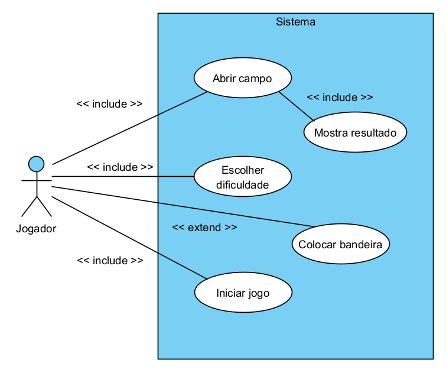

# Análise orientada a objeto

Análise orientada a objetos do jogo campo minado.

## Descrição Geral do domínio do problema

A aplicação a ser desenvolvida se trata de um jogo de Campo Minado. O conteúdo do jogo é, basicamente, um mapa de botões quadrados em que estão dispostas bombas escondidas aleatoriamente debaixo de alguns deles. O objetivo do jogador é clicar em todos os espaços que não possuem minas. Para saber onde deve clicar, cada botão livre de bomba indicará a quantidade de explosivos nos 8 quadrados adjascentes. Para marcar a localização de uma possível bomba, o jogador pode adicionar uma bandeira no botão correspondente, inibindo um clique acidental. A quantidade máxima dessas bandeiras é o número de bombas dispostas no mapa.
O jogador terá 3 dificuldades de mapa para jogar; o nível iniciante terá uma campo 10x10 com 10 bombas, o médio terá um 15x15 e 25 bombas e o avançado, 20x20 com 90 bombas.
Ao clicar em um botão com uma mina, o jogador recebe uma mensagem de game over e todas as bombas escondidas são reveladas. Ademais, um menu de resultados é apresentado com a quantidade de cliques realizados e o tempo do jogo. Ao vencer, o jogador também recebe uma mensagem e seus resultados.

  

  
## Diagrama de Casos de Uso

  

  
Inicialmente, o jogador entra na tela principal do jogo, onde há 5 botões (além do campo com minas): novo jogo - simbolizado por um emoji sorridente -, sobre (about), e as 3 dificuldades disponíveis - iniciante, médio e avançado. Ao clicar no emoji sorridente - novo jogo, o sistema restaura os botões e os contadores;

<h1>Caso de uso - escolher dificuldade:</h1>

Ao selecionar a dificuldade fácil, o mapa do campo minado gerará um grid 10x10; no médio, um grid 15x15 e no avançado, 20x20;

<h1>Caso de uso - Iniciar jogo:</h1>

No início do jogo, o usuário verá um layout de botões, um cronômetro zerado no canto superior direito e, no esquerdo, um contador fixo com o número máximo de flags que poderá utilizar;
Ao apertar o primeiro quadrado, o cronômetro é ativado, mostrando o tempo de jogo até que todos os botões sem bomba estejam descobertos ou se o jogador tenha clicado sobre uma bomba;
Ao ganhar, perder ou se estiver no meio de uma partida e o jogador quiser gerar um novo jogo, há 3 opções: clicar na tela espaço do teclado, apertar no botão com o emoji sorrindo (ou triste - se tiver perdido a partida) ou selecionar, na parte superior da janela, qual a dificuldade deseja para a próxima partida; as duas primeiras opções levam a um novo jogo na dificuldade antes selecionada.

<h1>Caso de uso - colocar bandeira:</h1>
 
Tendo a suspeita de alguma bomba, ele poderá marcar o quadrado com uma bandeira (flag); ao fazê-lo, o contador de flags irá subtrair da quantidade disponível. A quantidade inicial mostrada no contador se refere ao número de minas dispostas no grid; se o jogador clicar com o botão esquerdo em cima de uma bandeira já posicionada, nada acontece, já que ele presumiu que ali teria uma bomba; É possível retirar bandeiras posicionadas. Ademais, o jogador pode colocar quantas bandeiras quiser, porém o contador ficará negativo, sinalizando que há mais bandeiras posicionadas que o necessário;

<h1>Caso de uso - abrir campo:</h1>

Ao clicar em um botão, o sistema checará se há bombas nos 8 quadrados adjascentes a este e indicará a quantidade .
Se o botão clicado não tiver bombas em seus vizinhos, esse ponto não terá nenhum número e possíveis botões adjacentes a este que estiverem sem bombas serão descobertos automaticamente através desse clique, indicando o número de bombas se for o caso;
Clicando em um botão que tem bomba escondida, as demais bombas serão demonstradas no mapa com imagens de bombas e fundos vermelhos, e a bomba clicada terá um ícone especial, como se explodida de fato;
Ao mesmo tempo que o mapa mostrar todas as bombas descobertas, o menu de resultados aparecerá.

<h1>Caso de uso - mostra resultado:</h1>

Ao perder ou ganhar um jogo, o sistema mostrará uma janela com os resultados da partida. Uma mensagem evidenciará se o jogador perdeu ou ganhou, além dos segundos decorridos na partida e a quantidade de cliques no mouse, tanto do botão esquerdo quanto do direito. Haverá um botão próprio para fechar esta janela.

## Diagrama de Domínio do problema

## Diagramas de sequência

[Retroceder](README.md) | [Avançar](projeto.md)

