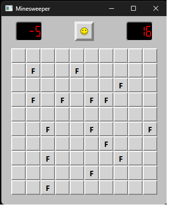

Versão 2 - Campo Minado

Nesta versão, adicionamos a base do recurso para posicionar flags em nosso campo. Se o jogador posicionar mais flags no campo, o contador mostrará o número negativo, para indicar que há mais flags posicionadas que bombas. Além disso, implementamos o cronômetro do jogo, que por enquanto reseta no momento que um novo jogo é criado. 

  

