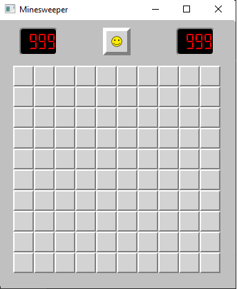

## Primeira versão - Campo Minado

Nesta primeira versão, iniciamos a criação das classes necessárias para implementar a base do jogo Campo Minado, conforme previmos em nossos diagramas UML. Além disso, estabelecemos a base gráfica do jogo, começando com a criação de uma janela e avançando até a criação de um layout de botões clicáveis e contadores.
  
  

  

